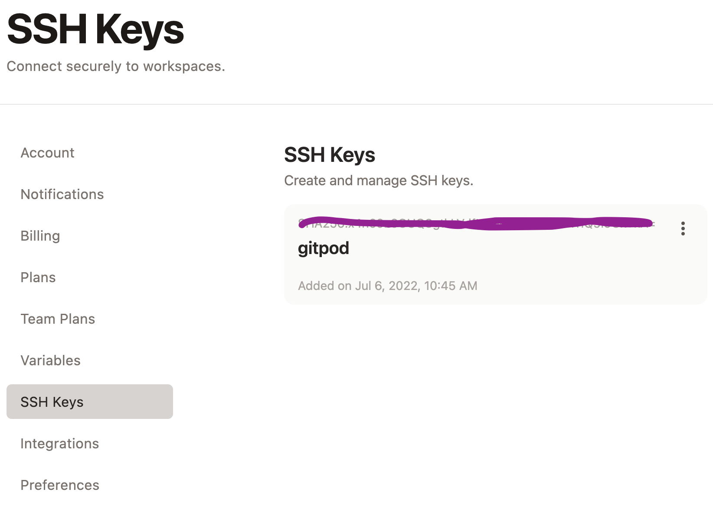

## GPG Signing

With the latest updates making gitpod remote IDE connections use SSH, and the just added "bring your own ssh publickey" to gitpod.io, combined that means to enable gpg signing you via agent forwarding you can now accomplish it this way:
- add publickey to your profile<br>
<br>
- update your .ssh/config to forward gpg keys to *.ssh.ws.gitpod.io servers, this is my example:
```
Host *.ssh.ws*.gitpod.io
    ServerAliveInterval 15
    IdentityFile /Users/cbarker/.ssh/gitpod
    RemoteForward /home/gitpod/.gnupg/S.gpg-agent /Users/cbarker/.gnupg/S.gpg-agent.extra
    StreamLocalBindUnlink yes
```
- Set your GPG_ID environment variable, using the key-id from a public key server (this .gitpod.yaml only runs this conditionally)
- Have a build task in your gitpod.yml to inject your public key, stop the gpg-agent (started because we initialized a public key), and configure git for your key (or in your workspace dockerfile, bashrc probably):
```yaml
tasks:
  - before: |
      gpg --keyserver keys.openpgp.org --recv-keys $GPG_ID
      gpgconf --kill gpg-agent
      git config --global user.signingkey $GPG_ID
```

Now when you launch your workspace via VS Code IDE or Jetbrains, it should automatically forward your SSH key. If you're in the web IDE, starting an ssh session from your workstation would also suffice.

In my configuration, my yubikey (setup from drduh's [guide](https://github.com/drduh/YubiKey-Guide)) hosts my private key. A side effect of this is that any commit signing or gpg action requires either pin + physical touch, or physical touch, before it will proceed. That makes me feel relatively secure knowing that while the socket is on a remote machine, the yubikey means I have to approve any use / access to the socket (I always require touch to sign and you can set a timeout for the pin approval).

## Troubleshooting

Sometimes after a while the gpg agent will die / timeout and you will need to restart it - 
There is some more work to be done on that.

## Tailscale

As a tangent to this, this repo also includes an example off setting up tailscale if 